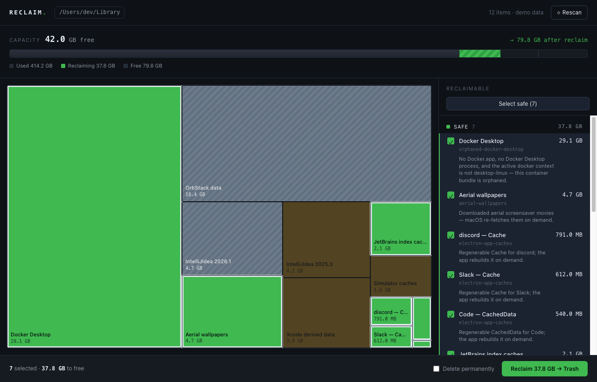

# Reclaim

**A risk-aware disk-space visualizer and recovery tool for developer Macs.**

Reclaim shows you exactly where your disk space went and lets you recover it
safely. Unlike generic visualizers, it understands *developer cruft* — orphaned
Docker VMs, old IDE versions, build caches, derived data — and classifies every
item by **how safe it is to delete**. The treemap is a risk map: block size is
bytes, block color is risk.



> Full product spec: [`Prd.md`](Prd.md). Project guide for contributors:
> [`CLAUDE.md`](CLAUDE.md).

## The risk model

Every scanned item gets exactly one class. The whole product hinges on getting
this right and on a safety gate the UI cannot bypass.

| Class | Meaning | Color | Selectable |
|---|---|---|---|
| **Safe** | Regenerates with no user-visible loss (caches, orphaned VMs). | mint | yes — "Select safe" eligible |
| **Review** | Reclaimable but with a cost (re-download, rebuild). | amber | opt-in per item |
| **Protected** | Real data or in-use config (volumes, current IDE). | steel | never — inert |

Ambiguity always resolves *up* toward Protected.

## Architecture

```
src/ (React webview) ─┐
                      ├─ scan() / reclaim() ─▶  reclaim-core (Rust)  ─▶  filesystem
MCP wrapper / agent ──┘                         • parallel walk + true on-disk size
                                                • detector catalogue → risk class
                                                • SAFETY GATE (re-validate every delete)
                                                • Trash (default) | permanent
```

- **`reclaim-core/`** — the engine and single source of truth. All risk logic
  and the safety gate live here; the UI and any agent are thin clients.
- **`src-tauri/`** — Tauri v2 shell exposing `scan` / `reclaim`. No logic.
- **`src/`** — React + TypeScript treemap UI ("diagnostic instrument" design).

### The safety gate

The UI sends item *ids*; the core independently re-derives each item's current
risk class and canonical path at execution time and refuses anything Protected
or outside `$HOME`. A buggy or compromised front end — or an over-reaching agent
— cannot delete protected data. Deletion defaults to move-to-Trash; permanent is
a deliberate per-item opt-in.

## Prerequisites

| Tool | Version | Needed for |
|---|---|---|
| [Rust](https://rustup.rs) + Cargo | 1.96+ | the core engine and CLI |
| [Node.js](https://nodejs.org) | 20+ (tested on 26) | the frontend |
| [pnpm](https://pnpm.io) | 9+ (tested on 11) | frontend package manager |
| macOS | 13+ (Apple Silicon or Intel) | v1 is macOS-only |

The Tauri CLI is **not** required globally — it ships as a dev dependency and is
run via `pnpm tauri`. The first `pnpm install` may prompt to approve esbuild's
build script; it is pre-approved in `pnpm-workspace.yaml`.

```bash
git clone <repo-url> && cd Reclaim
pnpm install        # frontend deps (also fetches the Tauri CLI)
```

## Running

There are three ways to run Reclaim, all over the same Rust core.

### 1. The desktop app (the real thing)

```bash
pnpm tauri dev
```

This launches the native window: it builds `reclaim-core`, starts the Vite dev
server, and opens the webview wired to the live `scan`/`reclaim` commands. First
run compiles the Tauri toolchain and takes a few minutes; later runs are fast and
hot-reload the UI.

> **macOS Full Disk Access:** some paths under `~/Library` require it. If a scan
> looks short, grant Reclaim Full Disk Access in **System Settings → Privacy &
> Security → Full Disk Access**, then rescan.

### 2. The UI in a browser (no native build)

```bash
pnpm dev            # then open http://localhost:1420
```

With no Tauri backend present, the UI runs on bundled **mock data** and never
touches your disk — ideal for working on the interface. The header shows
`demo data` in this mode.

### 3. The CLI (headless / scripting / CI cleanup)

A third client over the same core — handy for quick checks and automation.

```bash
# Scan ~/Library and print the JSON scan result
cargo run -p reclaim-core --bin reclaim -- scan ~/Library --pretty

# Scan a different root
cargo run -p reclaim-core --bin reclaim -- scan ~/Library/Caches

# Reclaim specific items by id (default = move to Trash)
cargo run -p reclaim-core --bin reclaim -- reclaim ~/Library aerials jetbrains-caches

# Permanently delete a specific large item (skips Trash; irreversible)
cargo run -p reclaim-core --bin reclaim -- reclaim ~/Library docker-desktop:permanent

# Reclaim every Safe-class item to Trash in one shot
cargo run -p reclaim-core --bin reclaim -- safe ~/Library
```

Item ids come from the `scan` output. Whatever you pass, the core re-validates
risk and the `$HOME` boundary — a Protected id is always refused.

For a faster CLI binary, build release once and call it directly:

```bash
cargo build --release -p reclaim-core
./target/release/reclaim scan ~/Library --pretty
```

## Testing & build

```bash
cargo test                       # 17 core tests — the safety gate has the most
cargo clippy                     # lints (kept clean)
pnpm build                       # typecheck (tsc) + production frontend build
pnpm tauri build                 # bundle the distributable .app (macOS)
```

## Project layout

```
reclaim-core/   Rust engine — scan, detectors, safety gate, reclaim, CLI
  src/detectors/  the declarative detector catalogue (the domain knowledge)
  src/safety.rs   the safety gate (re-validate risk + path on every delete)
src-tauri/      Tauri v2 shell — exposes scan/reclaim, no business logic
src/            React + TypeScript treemap UI
.claude/        project guide + subagent definitions for contributors
Prd.md          the product spec (source of truth for behavior)
```

## Status

M0 (MVP) is implemented and tested: `~/Library` scan, the Docker / JetBrains /
Electron-cache / aerials / Xcode / container-volume detectors, the treemap UI,
the safety gate, and Trash-first reclaim. MCP server + staged-autonomy agent path
(M2) are scaffolded by [`.claude/agents/mcp-developer.md`](.claude/agents/mcp-developer.md)
and reuse the same core unchanged.
